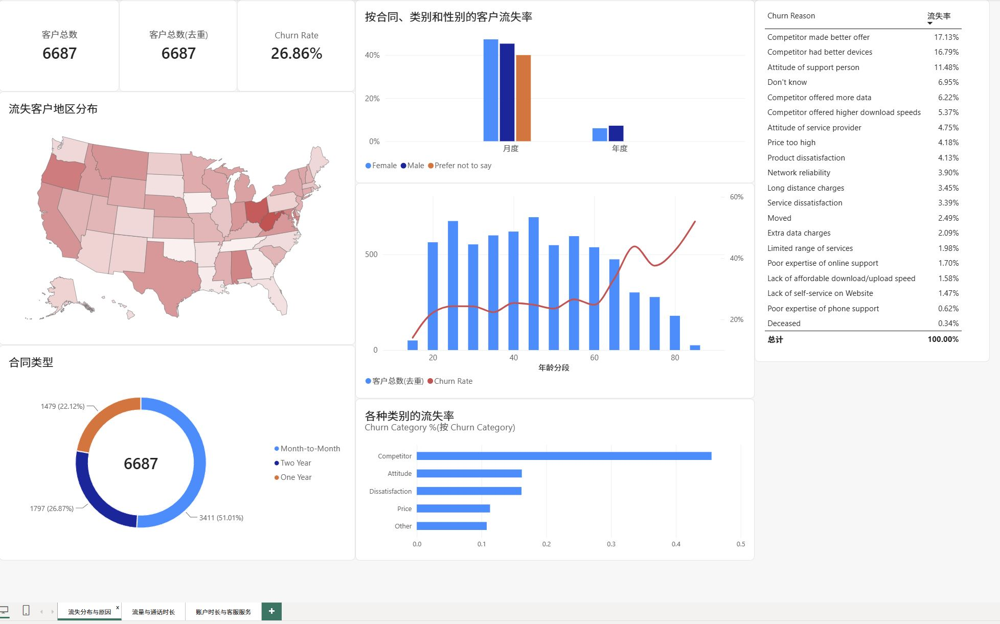
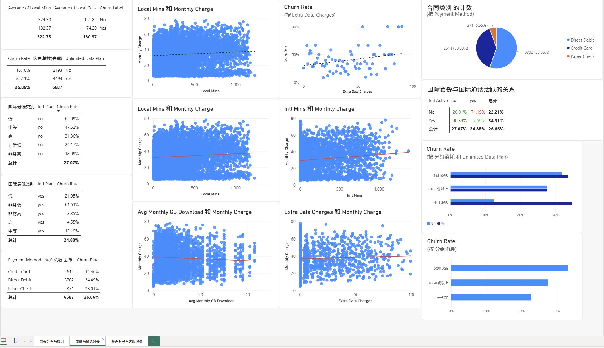
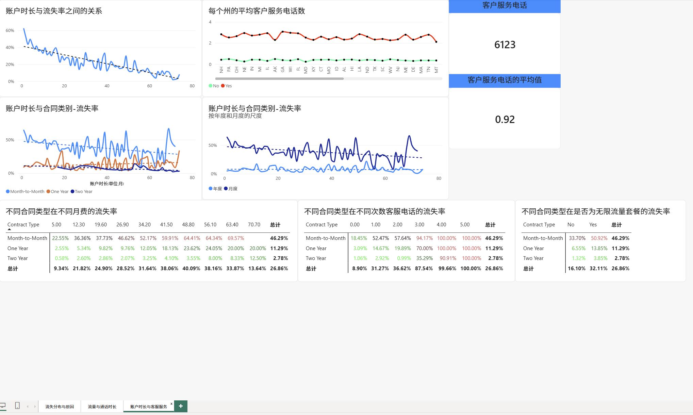

# 电信客户流失分析

## 1. 项目概述

本项目基于电信客户数据，使用 Power BI 分析客户流失情况，
探索不同客户特征、使用行为、费用和合同类型与客户流失之间的关系。

## 2. 分析目标

- 分析整体客户流失情况
- 识别高流失率客户群体
- 分析客户流失的主要原因
- 探索客户使用行为与流失之间的关系
- 分析费用和合同类型与客户流失之间的关系
- 通过交叉分析识别潜在高风险客户群体

## 3. 数据集

### 数据来源

本分析使用的数据源是来自 Datacamp 课程“案例研究：在 Power BI 中分析客户流失”的 CSV 数据集，它是 Databel 数据集在特定时间点的快照，共有 29 列，每一行代表一个客户。

### 数据字段

**原始数据字段**

| 字段 | 说明 |
|---|---|
| Customer ID | 客户编号 |
| Churn Label | 客户是否流失（Yes/No） |
| Age | 客户年龄 |
| Account Length | 客户账户持续时长（月） |
| State | 客户所在州/地区 |
| Contract Type | 合同类型 |
| Monthly Charge | 客户每月费用 |
| Local Mins | 本地通话时长 |
| Intl Mins | 国际通话时长 |
| Intl Plan | 是否国际套餐 |
| Avg Monthly GB Download | 每月平均下载流量(单位：GB) |
| Unlimited Data Plan | 是否无限流量套餐 |
| Extra Data Charges | 额外数据费用 |
| Payment Method | 支付方式 |
| Customer Service Calls | 客服联系次数 |
| Churn Category | 客户流失原因所属的大类 |
| Churn Reason | 客户具体的流失原因 |

**数据处理新增字段**

| 字段 | 说明 |
|---|---|
| Age (箱) | 将客户年龄划分为不同区间，用于分析不同年龄段客户的流失情况 |
| 合同类别 | 根据合同类型对客户进行分类，用于比较不同合同类型客户的流失情况 |
| Monthly Charge (箱) | 将客户月费用划分为不同区间，用于分析不同费用水平客户的流失情况 |
| 分组消耗 | 根据客户的消费/使用量区间对客户进行分组，用于比较不同消费水平客户的流失情况 |
| 国际最低类别 | 根据客户国际通话使用量划分的类别，用于分析不同国际通话使用水平与客户流失之间的关系 |

## 4. 数据处理

- 数据清洗
- 缺失值处理
- 字段类型转换
- 数据模型建立
- DAX 指标计算

## 5. 分析内容

### 5.1 客户基本特征

分析年龄、性别、地区和合同类型与客户流失之间的关系。

### 5.2 流失原因

分析不同流失原因的分布情况。

### 5.3 使用行为

分析本地通话、国际通话和数据使用情况与客户流失之间的关系。

### 5.4 客户服务

分析客服沟通次数与客户流失之间的关系。

### 5.5 费用与合同

分析月费、合同类型以及套餐特征与客户流失之间的关系。

## 6. Dashboard

### 6.1 流失地区分布与原因

### 6.2 流量与通话时长

### 6.3 账户时长与客服服务

## 7. 关键发现

- **合同类型是重要的流失相关因素：** 月付合同客户的流失率为 46.29%，显著高于一年期（11.29%）和两年期（2.78%）合同客户。

- **客户流失与账户时长呈负相关：** 账户时长较短的客户流失率较高，随着账户时长增加，流失率整体呈下降趋势。

- **竞争因素是主要流失原因：** 竞争对手相关因素占流失原因的 45.51%，其中更好的优惠和设备是最主要的具体原因。

- **客服服务与客户流失存在关联：** 流失客户在多数州的平均客户服务电话数高于未流失客户，表明服务互动频率与客户流失存在一定关系。

- **年龄与流失率呈正向关系：** 客户流失率整体随年龄增长而上升，高年龄客户群体的流失率相对较高。
  
- **套餐选择与国际通话行为存在潜在不匹配：** 国际通话较多但未开通国际套餐，以及国际通话较少却开通国际套餐的客户，均表现出60%以上的高流失率。

- **国际通话时长与月费仅呈弱正相关：** 两者之间的线性相关性较弱，表明国际通话时长本身并不能很好地解释月费变化。

## 8. 业务建议

- XXX
- XXX
- XXX

## 9. 使用工具

- Power BI
- DAX
- Power Query
