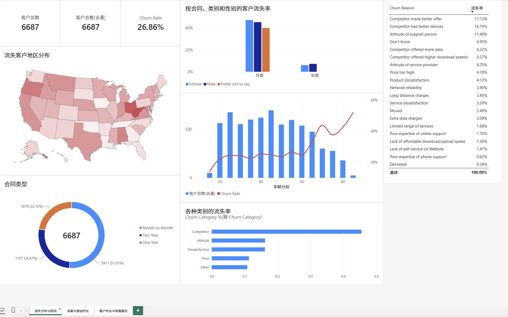
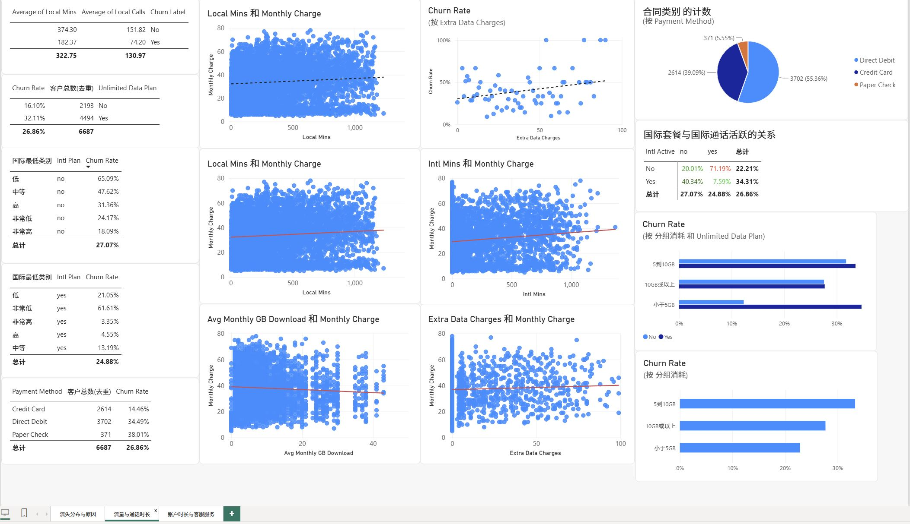
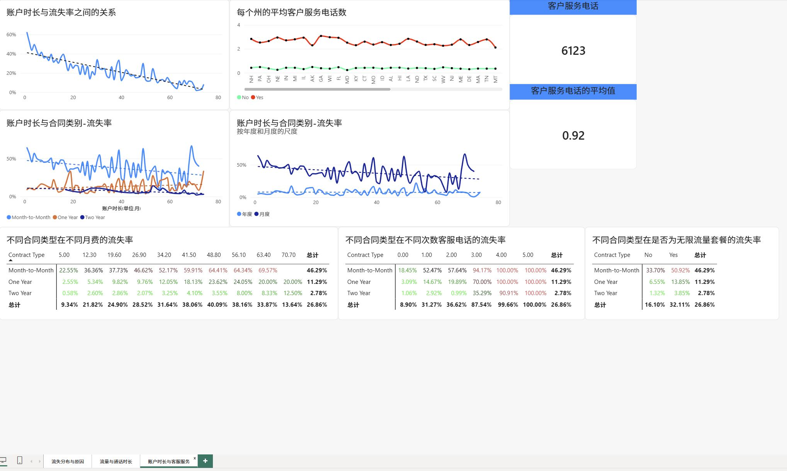

# 电信客户流失分析

> 基于 Databel 电信客户数据（6,687 名客户，29 个字段），用 Power BI 定位高流失客群、
> 拆解流失原因，并输出可落地的挽留策略。技术栈：Power BI + DAX + Power Query。
> 核心结论：整体流失率 **26.86%**；月付合同客户流失率高达 **46.29%**，
> 是两年期合同的 16.6 倍；**45.51%** 的流失由竞争对手因素导致。
>
> **注意**：客服联系次数与流失高度相关，但更可能是流失的**结果而非原因**，详见第 9 节。

---

## 1. 项目背景与数据来源

电信行业获客成本高、客户生命周期价值大，流失率每下降 1 个百分点都能带来可观的收入。
本项目围绕三个问题展开：

1. 流失集中在哪些客群？（谁要走）
2. 客户为什么走？（为什么走）
3. 哪些动作能降低流失？（怎么留住）

**数据来源**：数据集来自 DataCamp 案例研究
*Analyzing Customer Churn in Power BI* 提供的 Databel 数据快照。
教程给出了数据清洗与基础分析的框架，**本项目在其基础上补充了交叉分析、
套餐匹配度分析和地区差异探索**，并补充了因果方向与混杂因素的反思（见第 9 节）。

---

## 2. 数据集与字段说明

- **粒度**：一行 = 一名客户
- **规模**：6,687 行 × 29 列
- **目标变量**：`Churn Label`（Yes / No）

### 2.1 客户标识与基本信息

| 字段 | 说明 |
|---|---|
| `Customer ID` | 客户唯一编号 |
| `Phone Number` | 电话号码（脱敏） |
| `Gender` | 性别 |
| `Age` | 年龄 |
| `Under 30` | 是否 30 岁以下 |
| `Senior` | 是否标记为老年客户 |
| `State` | 所在州（美国） |

### 2.2 合同、费用与支付

| 字段 | 说明 |
|---|---|
| `Contract Type` | 合同类型：Month-to-Month / One Year / Two Year |
| `Payment Method` | 支付方式：Direct Debit / Credit Card / Paper Check |
| `Monthly Charge` | 月费 |
| `Total Charges` | 累计费用 |
| `Account Length (in months)` | 账户存续月数 |

### 2.3 通话与流量使用

| 字段 | 说明 |
|---|---|
| `Local Calls` | 本地通话次数 |
| `Local Mins` | 本地通话分钟数 |
| `Intl Calls` | 国际通话次数 |
| `Intl Mins` | 国际通话分钟数 |
| `Intl Active` | 是否产生过国际通话 |
| `Intl Plan` | 是否开通国际套餐 |
| `Extra International Charges` | 国际通话超额费用 |
| `Avg Monthly GB Download` | 月均下载流量（GB） |
| `Unlimited Data Plan` | 是否开通无限流量套餐 |
| `Extra Data Charges` | 流量超额费用 |

### 2.4 团体与增值服务

| 字段 | 说明 |
|---|---|
| `Group` | 是否属于集团客户 |
| `Number of Customers in Group` | 所属集团的客户数量 |
| `Device Protection & Online Backup` | 是否开通设备保障与在线备份 |
| `Customer Service Calls` | 客服联系次数 |

### 2.5 流失标签与原因

| 字段 | 说明 |
|---|---|
| `Churn Label` | 是否流失（Yes / No） |
| `Churn Category` | 流失原因大类 |
| `Churn Reason` | 流失原因明细 |

> **注意**：`Churn Category` 与 `Churn Reason` **只对已流失客户有值**，
> 非流失客户这两个字段为空。因此它们只能用于事后归因，
> **不能作为预测模型的特征**，否则会造成数据泄漏。详见第 9 节第 3 条。

### 2.6 建模过程中新建的计算字段

| 字段 | 说明 |
|---|---|
| `Age (箱)` | 年龄分段，用于观察不同年龄段的流失差异 |
| `Monthly Charge (箱)` | 月费分段 |
| `合同类别` | 合同类型的业务归类 |
| `分组消耗` | 按流量使用量分组（小于 5GB / 5-10GB / 10GB 以上） |
| `国际最低类别` | 按国际通话分钟数分组（非常低 / 低 / 中等 / 高 / 非常高） |

---

## 3. 技术栈

| 环节 | 工具 |
|---|---|
| 数据清洗与转换 | Power Query |
| 数据建模与指标计算 | DAX |
| 可视化 | Power BI Desktop |

**打开方式**：用 Power BI Desktop 打开 `powerbi/客户流失分析.pbix`。
若图表无法刷新，需在「转换数据 → 数据源设置」中把 CSV 路径改为本机路径。

---

## 4. 数据处理

在 Power Query 中完成，主要步骤：

1. **类型转换**：统一数值与日期字段类型，`Churn Label` 保持文本。
2. **缺失值处理**：【待补：说明哪些字段有缺失、缺失多少行、如何处理（保留 / 填充 / 删除）。】
3. **去重校验**：`Customer ID` 去重前后均为 **6,687**，说明不存在重复客户记录。
4. **计算列构建**：分箱字段（年龄、月费、流量、国际通话）见 2.6 节。
5. **数据模型**：单表模型，DAX 度量值集中管理。

---

## 5. Dashboard

Dashboard 共三页，交互版本见 `powerbi/` 目录下的 `.pbix` 文件。

### 5.1 流失地区分布与原因



### 5.2 流量与通话时长



### 5.3 账户时长与客服服务



---

## 6. 核心 DAX 度量值

> 以下为关键度量值的参考实现，实际以 `.pbix` 内的度量为准。

```dax
-- 客户总数
客户总数 = DISTINCTCOUNT('Databel'[Customer ID])

-- 流失客户数
流失客户数 = CALCULATE([客户总数], 'Databel'[Churn Label] = "Yes")

-- 流失率（核心指标）
Churn Rate = DIVIDE([流失客户数], [客户总数])


-- 每个 Customer ID 的 Customer Service Calls 的总和 的平均值 = 
AVERAGEX(
	KEEPFILTERS(VALUES('Databel - Data'[Customer ID])),
	CALCULATE(SUM('Databel - Data'[Customer Service Calls]))
)

-- Churn Category % = 
VAR TotalKnownCategory = 
    CALCULATE(
        [客户总数(去重)],
        'Databel - Data'[Churn Category] <> "Unknown" && 'Databel - Data'[Churn Category] <>BLANK()
    )
RETURN
    ROUND(
        DIVIDE([客户总数(去重)], TotalKnownCategory),
        4
    )
```

### 皮尔逊相关系数（用于「国际通话时长 vs 月费」）

Power BI 没有内置相关函数，需要用以下模式手算：

```dax
Intl Mins 与月费相关系数 =
VAR T =
    FILTER(
        'Databel',
        NOT ISBLANK('Databel'[Intl Mins]) && NOT ISBLANK('Databel'[Monthly Charge])
    )
VAR n   = COUNTROWS(T)
VAR sx  = SUMX(T, 'Databel'[Intl Mins])
VAR sy  = SUMX(T, 'Databel'[Monthly Charge])
VAR sxy = SUMX(T, 'Databel'[Intl Mins] * 'Databel'[Monthly Charge])
VAR sxx = SUMX(T, 'Databel'[Intl Mins] ^ 2)
VAR syy = SUMX(T, 'Databel'[Monthly Charge] ^ 2)
RETURN
    DIVIDE(n * sxy - sx * sy, SQRT((n * sxx - sx ^ 2) * (n * syy - sy ^ 2)))
```

---

## 7. 关键发现

### 7.1 合同类型是最强的流失相关因素

| 合同类型 | 客户数 | 占比 | 流失率 |
|---|---|---|---|
| Month-to-Month | 3,411 | 51.01% | **46.29%** |
| One Year | 1,797 | 26.87% | 11.29% |
| Two Year | 1,479 | 22.12% | **2.78%** |

月付合同客户的流失率是两年期合同的 **16.6 倍**，是全表中区分度最强的变量。
也因此，所有交叉分析都需要控制合同类型——因为合同类型同时影响多个其他变量
（月付客户的客服联系次数更多、增值服务开通率更低）。

### 7.2 流失原因：竞争对手因素占主导

流失原因大类中，竞争对手相关因素占 **45.51%**，远高于其他类别。

| 流失原因明细 | 占流失客户比例 |
|---|---|
| Competitor made better offer | 17.13% |
| Competitor had better devices | 16.79% |
| Attitude of support person | 11.48% |
| Don't know | 6.95% |
| Competitor offered more data | 6.22% |
| Competitor offered higher download speeds | 5.37% |

**解读**：价格和设备竞争力是主要流失动因，而非单纯的服务质量问题。
挽留策略的重心应放在**套餐性价比与终端补贴**，而不是只做客服体验优化。

### 7.3 套餐与实际使用不匹配的客户流失率异常高

| 国际通话活跃 | 是否开通国际套餐 | 流失率 |
|---|---|---|
| 否 | 否 | 20.01% |
| 否 | 是 | **71.19%** |
| 是 | 否 | 40.34%     |
| 是 | 是 | 7.59% |

**结论**：套餐与实际使用行为不匹配的客户（开通了套餐却不打国际电话，
或频繁打国际电话却没开通套餐）流失率明显高于匹配的客户。

### 7.4 无限流量与额外费用

| 是否无限流量套餐 | 客户数 | 流失率 |
|---|---|---|
| 否 | 2,193 | 16.10% |
| 是 | 4,494 | **32.11%** |

开通无限流量套餐的客户流失率反而更高。这与「套餐越贵越容易因价格流失」的直觉一致，
但也可能是**自选择效应**——使用量大、账单金额高的客户本来就更可能流失。
要区分这两者，需要客户开通套餐前后的对比数据。

### 7.5 支付方式与流失

| 支付方式 | 客户数 | 流失率 |
|---|---|---|
| Paper Check | 371 | **38.01%** |
| Direct Debit | 3,702 | 34.49% |
| Credit Card | 2,614 | 14.46% |

### 7.6 账户时长与流失

账户存续时间与流失率呈明显负相关：账户时长越短，流失率越高。
结合合同类型看，**月付合同客户在新开户阶段的流失风险最集中**，
这是挽留资源最该投入的窗口期。

### 7.7 年龄与流失

流失率整体随年龄上升，高龄客群流失率明显更高。

> ⚠️ **必须注明的限制**：高龄段的客户数量很少（年龄分布柱明显偏低），
> 小样本会让比率剧烈波动。图中 80 岁以上的高流失率很可能是样本量不足导致的假象。
> 解读时需要同时看各年龄段人数，或对样本量过小的年龄段做合并处理。

### 7.8 客服联系次数与流失

流失客户平均客服联系次数约 **2.5 次**，非流失客户约 **0.2 次**，差距超过 10 倍。

> ⚠️ **因果方向存疑**。这是本项目最重要的一处反思，详见第 9 节第 2 条。

### 7.9 国际通话时长与月费的关系

两者呈弱正相关，r = 0.08。
国际通话时长本身并不能很好地解释月费的变化，
这提示月费的构成可能更多取决于套餐档位而非通话用量。

---

## 8. 业务建议

- **提高长期合同转化率。** 月付客户是流失主体（占客户数 51%、流失率 46.29%）。
  建议设计阶梯式续约激励：续约满 6 个月赠送流量，
  满 12 个月升级为一年期合同并锁定折扣价。

- **针对竞对压力设计套餐。** 45.51% 的流失源于竞争对手，
  其中「更好的优惠」和「更好的设备」占比最高。
  建议推出**终端换新补贴 + 老客户专属折扣**的组合，
  并针对「流量」和「下载速度」这两个竞对优势点做定向升级。

- **检出套餐不匹配客户并主动推荐。** 对国际通话活跃但未开通套餐的客户，
  主动推送套餐升级；对开通套餐却几乎不打国际电话的客户，
  推送降档或权益转换方案。

- **把客服联系次数当作预警信号，而不是挽留手段。**
  流失客户的客服联系次数是非流失客户的 10 倍以上。
  **不建议把「提升客服质量」作为主要挽留策略**（原因见第 9 节第 2 条），
  更合适的做法是把「短期内多次联系客服」作为**流失风险预警指标**，
  触发人工关怀或专属优惠。

- **建立分群预警机制。** 综合合同类型、账户时长、客服联系次数、
  套餐匹配度四个维度打分，对高风险客户提前干预。

---

## 9. 局限与反思

1. **数据是静态快照，无法做趋势与因果推断。**
   所有结论都是**相关性**而非因果。例如「无限流量客户流失率更高」
   既可能是套餐本身的问题，也可能是高用量客户的自选择效应。

2. **「客服联系次数」很可能是流失的结果，而不是原因。**
   流失客户的客服联系次数是非流失客户的 10 倍以上，这个差距过大，
   更符合「客户已经决定要走，所以频繁联系客服办理业务或投诉」的行为模式，
   而不是「客服体验差导致客户流失」。如果是前者，
   那么常见的「改善客户服务体验」这个挽留建议方向就是反的。
   **验证方法**：需要客服联系的时间戳，把联系时间与流失时间对齐，
   观察联系行为发生在流失决策之前还是之后。

3. **流失原因字段存在选择性偏差。**
   `Churn Reason` 只对已流失客户采集，非流失客户的「潜在流失原因」无从得知；
   且「Don't know」占 6.95%，说明原因采集本身就不完整。
   更重要的是，这个字段**不能作为预测特征**，否则会造成严重的数据泄漏。

4. **缺少交叉控制。** 合同类型与套餐、支付方式、客服联系次数高度相关，
   单变量分析的结果可能被合同类型混杂（confounding）。
   例如 7.6 中「账户时长越短流失率越高」，
   很可能主要是月付合同客户的表现，而非账户时长的独立效应。
   **改进方向**：按合同类型分层后重算各指标，观察结论是否变化。

5. **高龄段样本量不足。** 7.7 中 80 岁以上客群的流失率受小样本影响严重，结论不可靠。

6. **地区差异尚未深入。** 各州在客服联系次数与流失的关系上存在差异
   （如加州呈现出与其他州不同的模式），但目前只是观察到现象，
   没有结合当地竞争格局与套餐投放策略做进一步归因。

7. **未建立预测模型。** 当前分析停留在描述性与诊断性层面，
   没有对客户流失概率做量化预测，因此「分群预警机制」这条建议
   目前还缺少可执行的分值标准。

---

## 10. 后续计划

- [ ] 按合同类型分层，重算第 7 节各指标，验证结论是否稳健
- [ ] 获取客服联系的时间戳，验证客服联系与流失的先后顺序
- [ ] 用逻辑回归或决策树做流失预测，输出特征重要性，
      与当前单变量分析的结论交叉验证
- [ ] 评估模型的召回率与精确率取舍：
      挽留成本不高时优先保召回，避免漏掉高风险客户
- [ ] 补充客户获客成本与生命周期价值，用金额口径量化挽留策略的收益

---

## 参考资料

- 数据集与案例框架：DataCamp *Analyzing Customer Churn in Power BI*（Databel 数据集）
